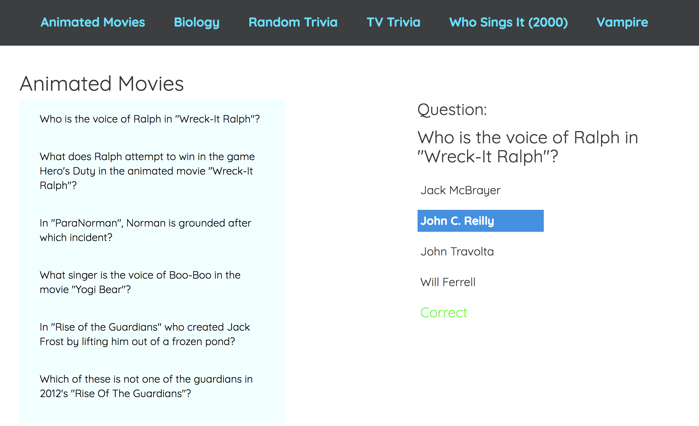

# Trivia App

This single page application lets you to test your knowledge of various trivia, organized by category.

Trivia categories are displayed at the top of the page and, as you click on a category, the app pulls a lists of questions from the Qriusity API.

Scroll through the questions, and when you see one that interests you, click on it and the full question along with possible answers will appear on the page.

Click on the answer(s) and a message will display letting you know whether it was the correct answer or not.

When you are ready to move on, just select another question from the list, or click on a new category to see different questions.

Note: Do you like to multitask?  Me too!  Which is why I've implemented responsive design tactics.  So shrink the page down and keep on playing.  (If you answered no, that's okay too.  Expand the page to it's full width and enjoy!)


## Built With

* [React](https://reactjs.org/) - The web framework used
* [Redux](https://redux.js.org/) - State Management
* [Qriusity](https://qriusity.com/) - Trivia API
* [Axios](https://github.com/axios/axios) - GET request for trivia 
* Javascript, HTML, CSS - for your enjoyment 


## Screenshots

### Initial view 


### Questions List view


### Small screen view


```
Give the example
```

And repeat

```
until finished
```

## Author

* **Erica Stone** [plum03](https://github.com/plum03)


## Acknowledgments

* Hat tip to the creators of Qriusity for this API and for making the documentation so easy to follow!


